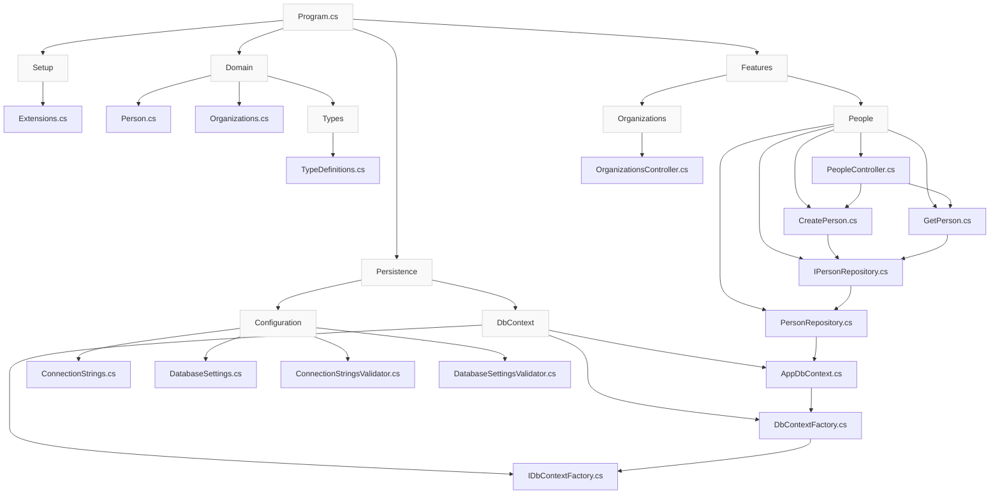

A super quick overview of the layout:

```mermaid
graph TD
    A[Program.cs]
    A --> B[Setup]
    B --> B1[Extensions.cs]

    A --> C[Persistence]
    C --> C1[DbContext]
    C1 --> C1a[AppDbContext.cs]
    C1 --> C1b[DbContextFactory.cs]
    C1 --> C1c[IDbContextFactory.cs]
    C --> C2[Configuration]
    C2 --> C2a[ConnectionStrings.cs]
    C2 --> C2b[DatabaseSettings.cs]
    C2 --> C2c[ConnectionStringsValidator.cs]
    C2 --> C2d[DatabaseSettingsValidator.cs]

    A --> D[Domain]
    D --> D1[Person.cs]
    D --> D2[Organizations.cs]
    D --> D3[Types]
    D3 --> D3a[TypeDefinitions.cs]

    A --> E[Features]
    E --> E1[People]
    E1 --> E1a[PeopleController.cs]
    E1 --> E1b[CreatePerson.cs]
    E1 --> E1c[GetPerson.cs]
    E1 --> E1d[PersonRepository.cs]
    E1 --> E1e[IPersonRepository.cs]
    E --> E2[Organizations]
    E2 --> E2a[OrganizationsController.cs]

    %% Relationships
    E1a --> E1b
    E1a --> E1c
    E1b --> E1e
    E1c --> E1e
    E1e --> E1d
    E1d --> C1a
    C1a --> C1b
    C1b --> C1c

    classDef folder fill:#f9f9f9,stroke:#ccc,stroke-width:1px;
    class A,B,C,C1,C2,D,D3,E,E1,E2 folder;

```